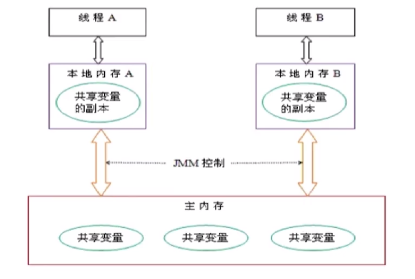

# Java内存模型JMM 
> Java内存模型本身是一种抽象的概念，并不真实存在，它描述的是一组规则或者规范，通过这个规范定义了程序各个变量(实例字段，静态字段和高层数组对象的元素)的访问方式

## 1. JMM中的主内存
* 存储Java实例对象
* 包括成员变量，类信息，常量，静态变量等
* 主内存为共享数据，当多个线程访问通一个数据时可能引发安全问题
## 2. JMM中的工作内存
* 存储当前方法的所有本地变量信息，本地变量对其它线程不可见
* 共享变量的副本
* 字节码行号指示器，Native方法信息
* 属于线程私有数据区域，不存在线程安全问题
## 3. happens before

## 4. volatile
* 读取volatile修饰的变量时将当前线程的工作区内存致为无效，也就是说不读取本地的共享变量副本
* 写入volatile修饰的变量时将工作区的共享变量刷新到主内存中
* volatile可以禁止JVM优化-指令重排序
* volatile与synchronized的区别
    1. volatile是告诉JVM变量在寄存器中是不确定的，需要从主存中读取，synchronized则是锁定当前变量，只有当前线程可以访问
    2. volatile仅能实现变量的可见性，不能保证原子性，而synchronized都可以
    3. volatile不会阻塞线程，synchronized是可以的
    4. volatile标记的变量不会被编译器优化，而synchronized会
